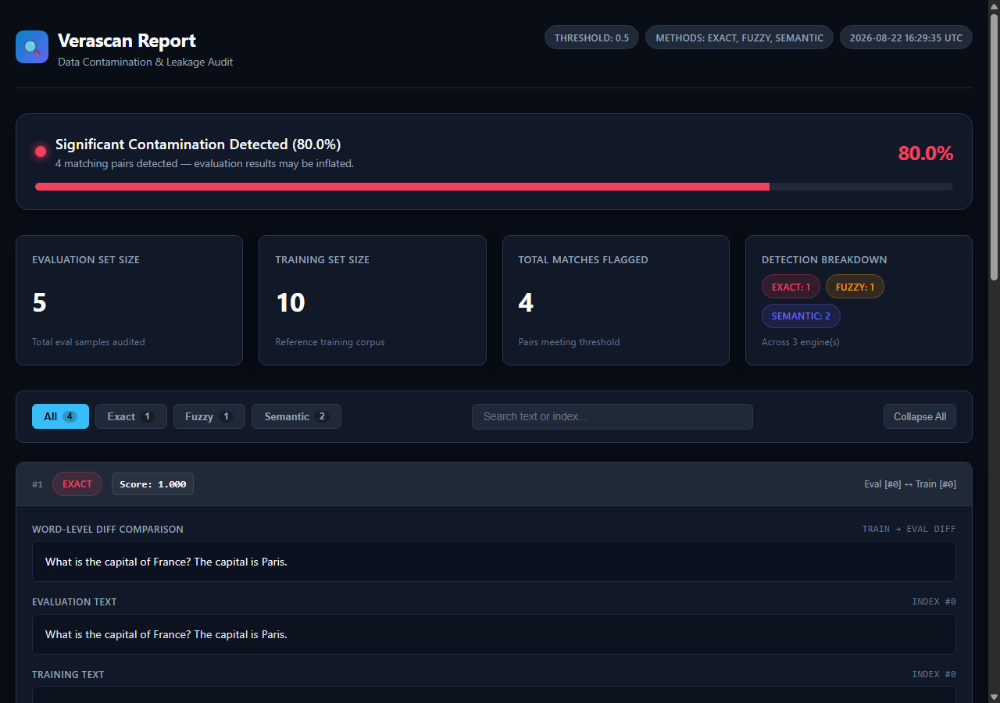

<div align="center">

# Verascan

**Data Contamination & Leakage Detection for AI / ML Workflows**

[](https://pypi.org/project/verascan/)
[](https://pypi.org/project/verascan/)
[](https://github.com/balamuruganpg/verascan/blob/main/LICENSE)
[](https://github.com/balamuruganpg/verascan/actions)
[](https://mypy-lang.org/)
[](https://github.com/astral-sh/ruff)

<br>

<p align="center">
  <strong>Detect exact, n-gram, fuzzy, and semantic data leakage between training and evaluation datasets.</strong><br>
  Built for LLM fine-tuning, benchmark integrity, RAG validation, and synthetic data auditing.
</p>

<br>

<p align="center">
  
</p>

</div>

---

## 🎯 Overview

Data contamination occurs when evaluation or benchmark examples leak into a model's training data. This compromises evaluation validity, inflates benchmark scores, and masks real-world model degradation.

**Verascan** provides a multi-tier contamination detection pipeline:
1. **Exact match** — $O(N)$ hash-based verbatim duplicate detection with normalisation.
2. **N-gram overlap** — GPT-3-style word 13-gram collisions (Brown et al., 2020) with frequency filtering.
3. **Fuzzy match** — MinHash + Locality-Sensitive Hashing (LSH) for near-duplicates and minor edits.
4. **Semantic match** — Dense embedding similarity search (`sentence-transformers` + FAISS) for paraphrased content.

---

## ✨ Features

- **Multi-Tier Detection**: Run exact, ngram, fuzzy, and semantic algorithms independently or in a cascaded pipeline.
- **Cross-Method Deduplication**: Matches identified by earlier methods are automatically excluded from later passes to prevent double-counting.
- **Multi-Format Ingestion**: Natively accepts `pandas.DataFrame`, `JSONL`, `CSV`, Hugging Face `datasets.Dataset`, and Python `list[str]`.
- **Interactive HTML Reports**: Generates self-contained, offline-ready HTML reports featuring live search, method filtering, and word-level diffs.
- **Cleaned Eval Export**: Drop contaminated eval rows and write a reusable CSV/JSONL set (`cleaned_eval()`, `to_cleaned()`, CLI `--output-cleaned`).
- **CI/CD Integration**: CLI includes `--fail-above` to fail builds if contamination exceeds an allowed threshold.
- **Lightweight Core**: Installs cleanly with minimal dependencies; heavy ML dependencies (`sentence-transformers`, `faiss-cpu`) are optional extras.
- **Noise-Free Execution**: Built-in log suppression prevents noisy C++/oneDNN and framework deprecation logs from polluting `stderr`.

---

## 🔬 Detection Engines

| Method | Algorithm | Complexity / Speed | Best For |
|---|---|---|---|
| **`exact`** | SHA-256 Content Hashing (normalised) | $O(N + M)$ &bull; *Microseconds* | Verbatim duplicates, casing/whitespace variations |
| **`ngram`** | Word *n*-gram overlap (GPT-3 / Brown et al.) | $O(N + M)$ &bull; *Milliseconds* | Long shared phrases; classic 13-gram contamination |
| **`fuzzy`** | MinHash + LSH (`datasketch`) | $O(N + M)$ &bull; *Milliseconds* | Minor edits, word insertions/deletions, truncations |
| **`semantic`** | Dense Vector Cosine Similarity (FAISS) | $O(M \cdot d)$ &bull; *Seconds* | Paraphrased sentences, reworded questions, synonyms |

---

## 📦 Installation

```bash
# Core installation (exact + fuzzy matching)
pip install verascan

# With semantic similarity matching (sentence-transformers + FAISS)
pip install "verascan[semantic]"

# With Hugging Face datasets support
pip install "verascan[hf]"

# Complete installation with all optional extras
pip install "verascan[all]"
```

---

## 🚀 Quickstart

### Python API

```python
import verascan

# Run contamination audit across training and evaluation splits
report = verascan.check(
    train="data/train.jsonl",
    eval="data/eval.jsonl",
    methods=["exact", "ngram", "fuzzy", "semantic"],
    threshold=0.85,
)

# Print terminal summary
report.summary()

# Inspect metrics
print(f"Contamination Rate: {report.contamination_rate:.1%}")
print(f"Flagged Pairs     : {report.total_matches}")

# Query high-confidence matches
for match in report.flagged(min_score=0.90):
    print(
        f"[{match.method}] Eval #{match.eval_index} <-> Train #{match.train_index} (Score: {match.score:.3f})"
    )
    print(f"  Eval : {match.eval_text}")
    print(f"  Train: {match.train_text}")

# Export interactive HTML and machine-readable JSON reports
report.to_html("contamination_report.html")
report.to_json("contamination_report.json")

# Export a decontaminated eval set (contaminated rows removed)
cleaned = report.cleaned_eval()          # list[str] or pandas.DataFrame
report.to_cleaned("eval_cleaned.jsonl")  # .jsonl, .csv, or .json
```

### Terminal Output

```text
===============================================
  Verascan Contamination Report
===============================================
  Train size      : 50,000
  Eval size       : 1,000
  Methods         : exact, fuzzy, semantic
  Threshold       : 0.85
-----------------------------------------------
  Total matches   : 14
  Contaminated    : 12 / 1,000 eval samples (1.2%)
    Exact matches : 4
    Fuzzy matches : 7
    Semantic hits : 3
===============================================
```

---

## 📂 Supported Input Formats

Verascan normalises inputs into clean text sequences automatically:

```python
import pandas as pd
import verascan

# 1. Plain String Lists
report = verascan.check(
    train=["The quick brown fox.", "Artificial intelligence."],
    eval=["The quick brown fox."],
)

# 2. File Paths (CSV or JSONL)
report = verascan.check(
    train="data/train.jsonl",
    eval="data/eval.csv",
    column="text",
)

# 3. Pandas DataFrames
train_df = pd.DataFrame({"prompt": ["Translate to French...", "Summarize..."]})
eval_df = pd.DataFrame({"prompt": ["Translate to French..."]})
report = verascan.check(train=train_df, eval=eval_df, column="prompt")

# 4. Hugging Face Datasets
from datasets import load_dataset

train_ds = load_dataset("imdb", split="train")
eval_ds = load_dataset("imdb", split="test")
report = verascan.check(train=train_ds, eval=eval_ds, column="text")
```

---

## 💻 CLI Usage

The `verascan` command-line interface enables automated checks in terminal workflows and CI/CD pipelines:

```bash
# Basic contamination check
verascan check --train data/train.jsonl --eval data/eval.jsonl

# Specify custom column, methods, and threshold
verascan check \
  --train data/train.csv \
  --eval data/eval.csv \
  --methods exact,fuzzy \
  --threshold 0.80 \
  --column text \
  --output report.html \
  --output-cleaned eval_cleaned.jsonl

# CI/CD Gate: Fail build if contamination rate exceeds 1%
verascan check \
  --train data/train.jsonl \
  --eval data/eval.jsonl \
  --fail-above 0.01
```

---

## 📊 Interactive HTML Reports

The HTML report generated via `report.to_html("report.html")` is **100% self-contained** (no external fonts, CDNs, or scripts required):

- **Health Status Banner**: Visual indicator (`Clean`, `Low Risk`, `High Risk`) with contamination percentage and progress meter.
- **Method Breakdown**: Color-coded badges for exact (Rose), fuzzy (Amber), and semantic (Indigo) detections.
- **Live Search & Filtering**: Instant client-side search across text samples and index numbers.
- **Word-Level Diffs**: Color-coded `<del>` and `<ins>` tags illustrating textual overlap.
- **Responsive Layout**: Designed for seamless viewing across desktop monitors and mobile devices.

---

## ⚙️ ContaminationReport API

```python
report = verascan.check(train, eval)

# Properties
report.contamination_rate  # float: Fraction of eval examples found in train (0.0 to 1.0)
report.total_matches  # int: Total flagged pairs
report.exact_count  # int: Exact duplicate count
report.ngram_count  # int: N-gram overlap match count
report.fuzzy_count  # int: Fuzzy / near-duplicate count
report.semantic_count  # int: Semantic match count
report.train_size  # int: Size of training corpus
report.eval_size  # int: Size of evaluation corpus

# Methods
report.flagged(min_score=0.9)  # Returns list of MatchRecord objects >= min_score
report.summary()  # Prints ASCII summary to stdout
report.to_dict()  # Serialises report to a Python dict
report.to_json("report.json")  # Exports JSON file
report.to_html("report.html")  # Exports self-contained interactive HTML report
report.cleaned_eval()  # Eval examples with contaminated rows removed
report.contaminated_eval()  # Eval examples that were flagged
report.to_cleaned("eval_clean.jsonl")  # Write cleaned eval as CSV / JSONL / JSON
report.to_contaminated("eval_flagged.jsonl")  # Write flagged eval rows
```

### `MatchRecord` Structure

Each match in `report.matches` contains:
- `eval_index: int` — Index of the sample in the evaluation dataset.
- `train_index: int` — Index of the sample in the training dataset.
- `eval_text: str` — Evaluation sample text.
- `train_text: str` — Matching training sample text.
- `score: float` — Similarity metric (`1.0` for exact matches, n-gram overlap ratio for ngram, Jaccard for fuzzy, cosine for semantic).
- `method: str` — Engine that produced the match (`"exact"`, `"ngram"`, `"fuzzy"`, `"semantic"`).

---

## ⚠️ Limitations

- **Large-Scale Semantic Search**: While FAISS provides fast approximate search, semantic matching encodes all samples using transformer models, which is compute-intensive on CPU for corpora with millions of rows. For very large datasets, start with `methods=["exact", "fuzzy"]`.
- **Character N-Gram Sensitivity**: Fuzzy matching relies on character 5-grams by default. Very short texts (fewer than 5 characters) fall back to exact matching.
- **Word N-Gram Length**: The `ngram` method needs at least `ngram_n` words (default 13) after cleaning; shorter eval texts produce no n-gram matches.
- **Cross-Lingual Matching**: The default semantic model (`all-MiniLM-L6-v2`) is optimized for English text. For multilingual evaluation datasets, specify a multilingual model via `model_name="paraphrase-multilingual-MiniLM-L12-v2"`.

---

## 🛠️ Development

```bash
# Clone repository
git clone https://github.com/balamuruganpg/verascan.git
cd verascan

# Install development dependencies
pip install -e ".[all,dev]"

# Run test suite
pytest

# Code formatting and linting
ruff check .
ruff format --check .

# Type checking
mypy src/
```

---

## 📄 License

Distributed under the [MIT License](https://github.com/balamuruganpg/verascan/blob/main/LICENSE).
